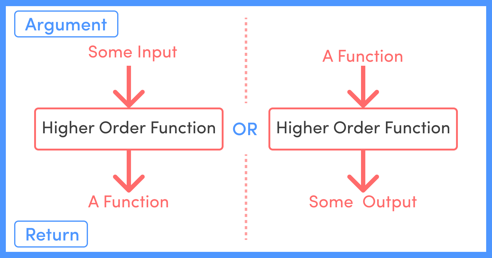

# Higher-Order Functions

- **Higher-order functions** are functions that can take other functions as arguments or return functions as their results.
    
    
    
- They enable a functional programming style in JavaScript and are powerful tools for managing and manipulating functions and data.

## Example

**Example 1:** Using map() as a higher-order function

```jsx
let numbers = [1, 2, 3, 4, 5];
let squaredNumbers = numbers.map(function (num) {
  return num * num;
});
console.log(squaredNumbers); // Output: [1, 4, 9, 16, 25]
```

**Example 2:** Using filter() as a higher-order function

```jsx
let words = ["apple", "banana", "cherry", "date", "elderberry"];
let filteredWords = words.filter(function (word) {
  return word.length > 5;
});
console.log(filteredWords); // Output: ['banana', 'cherry', 'elderberry']
```

## Usage

- They are used to abstract over actions, create utilities, and generalize common patterns.
- They facilitate the writing of reusable code that is more expressive and easier to maintain.

### Reference:

[Higher Order Functions in JavaScript – Beginner's Guide](https://www.freecodecamp.org/news/higher-order-functions-in-javascript/)

[Pass Function to Other Functions](./Pass%20Function%20to%20Other%20Functions.md)
