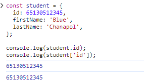

# Dot Notation vs. Bracket Notation

In JavaScript, there are two ways to access and manipulate the properties of an object.

1. Dot `.`
2. Square brackets `[]`

Let’s take a look at an example:

```jsx
const student = {
  id: 65130512345,
  firstName: "Blue",
  lastName: "Chanapol",
};

console.log(student.id);
console.log(student["id"]);
```



As you can see, the result is the same, but are they really identical?

## Dot Notation

The syntax of accessing and manipulation the properties of an objects is:

```jsx
someObj.key;
```

### Let’s take a quick tour of using dot notation.

Accessing the property of an object.

```jsx
const person = {
  age: 10,
};
console.log(person.age);
```


The result of the above code

Now let’s try to modify the value of property.

```jsx
const person = {
  age: 10,
};
person.age = 19;
console.log(person.age);
```


The result of the above code

And you can add the new property to an object.

```jsx
const person = {
  age: 10,
};
person.nickname = 'Blue';
console.log(person.nickname);
```


The result of the above code

---

## Square Brackets

The syntax of accessing and manipulation the properties of an objects is:

```jsx
someObj[expression]
```

As you can see, the square bracket allows you to use the expression in the brackets, which allows more dynamically and led to determine the property name during runtime.

### Let’s take a quick tour of using Square Bracket notation.

Accessing the property of an object

```jsx
const person = {
  id: 65130512345,
};
console.log(person['id']);
```


The result of the above code

Now let’s try to modify the value of property.

```jsx
const person = {
  id: 65130512345,
};
person['id'] = 65130554321;
console.log(person['id']);
```


The result of the above code

And you can add the new property to an object.

```jsx
const person = {
  id: 65130512345,
};
person['name'] = 'Samart';
console.log(person['name']);
```


The result of the above code

Now, let’s try to access the data dynamically.

```jsx
const data = {
  data1: "And I don't want the world to see me",
  data2: "'Cause I don't think that they'd understand",
  data3: "When everything's made to be broken",
  data4: 'I just want you to know who I am',
  data5: 'I just want you to know who I am',
};

for (let i = 1; i <= 5; i++) {
  console.log(data['data' + i]);
}
```


The result of the above code

### References:

[Dot Notation vs Bracket Notation for Object Properties – What's the Difference?](https://www.freecodecamp.org/news/dot-notation-vs-square-brackets-javascript/)
